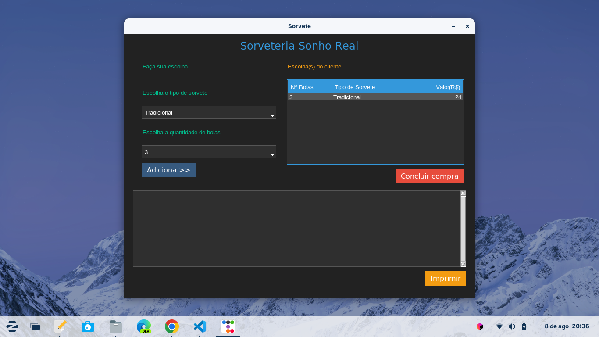

# SORVETERIA
Exemplo de aplicação usando ttkbootstrap

## Crie o diretório do app
$ mkdir sorveteria

## Entre no diretório
$ cd sorveteria

## Crie o ambiente virtual
$ python3 -m venv

## Instale o ttkbootstrap
$ pip install ttkbootstrap
ou 
$ pip install -r requirements.txt

## Crie o arquivo principal
$ touch main.py
Neste arquivo será construida a aplicação

## Excecute o app
$python3 main.py
